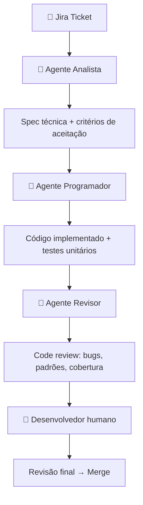
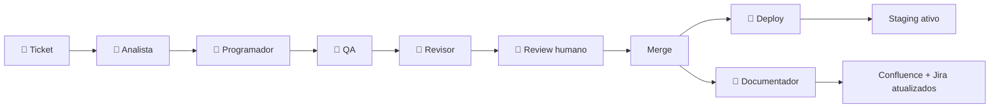

# De ferramenta individual a vantagem competitiva do time

**Proposta de workflow de desenvolvimento com IA**

  
    Engenharia · 2026
  

---
layout: default
---

# Antes de começar: o que a IA não resolve sozinha

<v-clicks>

- **"A IA aprende com o tempo"** → não aprende — cada conversa começa do zero
- **"Jogar toda a documentação resolve"** → documentação vira token — excesso degrada a resposta
- **"Mais contexto = melhor resultado"** → contexto precisa ser cirúrgico, não exaustivo
- **Consequência prática:** o workflow precisa de estrutura humana para que a IA seja efetiva

</v-clicks>

---
layout: two-cols
---

# Fase 1: O Problema

Código gerado com Cursor ainda exige muito do dev

<v-clicks>

- Dev escreve ticket → interpreta a spec sozinho → codifica → abre PR → espera review
- A IA ajuda a escrever código, mas não entende o ticket nem revisa o resultado
- Review humano é feito sobre código não validado: encontra bugs que a IA poderia ter pego

</v-clicks>

::right::

**Gap de IA aqui**

O Cursor é reativo — responde ao que o dev digita, não ao que o ticket pede

---
layout: default
---

# Fase 1 (Mês 1): Do ticket Jira ao PR revisado por agentes

✅ **Critério de sucesso:** PR pronto para revisão humana em menos de 2h após abertura do ticket

---
layout: two-cols
---

# Fase 2: O Problema

O pipeline para na porta do merge

<v-clicks>

- Deploy ainda é manual ou semi-automatizado
- Testes de integração e E2E ficam fora do ciclo dos agentes
- Confluence e Jira não são atualizados após o merge

</v-clicks>

::right::

**Gap de IA aqui**

O pipeline cobre o código, mas o ciclo de entrega continua dependendo de ação humana além do review

---
layout: default
---

# Fase 2 (Mês 2): Pipeline estendido até o deploy

✅ **Critério de sucesso:** lead time do ticket ao deploy em staging abaixo de 4h

---
layout: two-cols
---

# Fase 3: O Problema

A memória que o time não tem

<v-clicks>

- "Por que escolhemos essa arquitetura?" — ninguém lembra
- Obsidian e Confluence existem, mas ninguém consulta antes de decidir
- Novos membros gastam semanas para ganhar contexto

</v-clicks>

::right::

**Gap de IA aqui**

Agentes sem memória persistente repetem erros e ignoram restrições passadas

---
layout: default
---

# Fase 3 (Mês 3): Knowledge Graph como memória do time

<v-clicks>

- **Obsidian** vira fonte de verdade de ADRs (Architecture Decision Records)
- **Pipeline de ingestão:** Jira + GitLab + Confluence → índice vetorial consultável pela IA
- **Qualquer agente** do pipeline consulta o grafo antes de gerar output
- **Resultado:** a IA responde "por que X?" com base em decisões reais, não em suposições

</v-clicks>

✅ **Critério de sucesso:** novo dev onboardado em 2 dias com auxílio do knowledge graph

---
layout: center
class: text-center
---

# Roadmap

| | Mês 1 | Mês 2 | Mês 3 |
|---|---|---|---|
| **Foco** | Ticket → PR por agentes | Pipeline até o deploy | Knowledge Graph ativo |
| **KPI** | PR em < 2h | Deploy em < 4h | Onboarding em 2 dias |

**Próxima ação concreta:** escolher 1 feature no backlog e rodar a Fase 1 como piloto na próxima sprint

