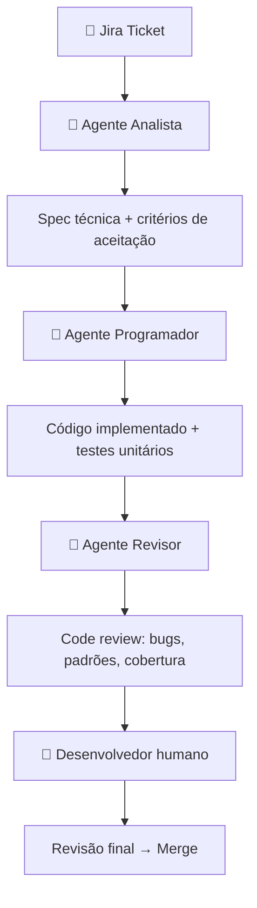
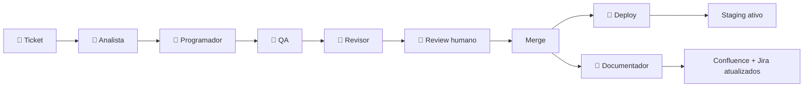

# Slides: Workflow de IA para Time de Engenharia — Implementation Plan

> **For agentic workers:** REQUIRED SUB-SKILL: Use superpowers:subagent-driven-development (recommended) or superpowers:executing-plans to implement this plan task-by-task. Steps use checkbox (`- [ ]`) syntax for tracking.

**Goal:** Criar um deck de 9 slides em Slidev apresentando a proposta de workflow de IA com fases de 1 mês cada, exportável para PDF.

**Architecture:** Um único arquivo `slides.md` com sintaxe Slidev, usando o tema `seriph` (profissional, colorido, tipografia forte). Diagramas de pipeline via Mermaid. Exportação para PDF via `npx slidev export`.

**Tech Stack:** Slidev (`@slidev/cli` via npx), tema `@slidev/theme-seriph`, Mermaid (embutido no Slidev).

## Global Constraints

- Idioma: Português brasileiro em todo o conteúdo
- Máximo 2 slides por subtema (1 problema + 1 solução)
- Cada slide de problema inclui um bullet "Gap de IA aqui:"
- Ferramentas citadas: Cursor e Claude (nunca Copilot ou ChatGPT)
- Todas as fases com prazo de 1 mês (Mês 1, Mês 2, Mês 3)
- Spec de referência: `docs/superpowers/specs/2026-07-03-workflow-ia-desenvolvimento-design.md`

---

### Task 1: Criar o arquivo de slides

**Files:**
- Create: `docs/presentations/workflow-ia-dev/slides.md`

**Interfaces:**
- Produz: arquivo Slidev completo com 9 slides prontos para preview

- [ ] **Step 1: Criar o diretório**

```bash
mkdir -p docs/presentations/workflow-ia-dev
```

- [ ] **Step 2: Criar `slides.md` com o conteúdo completo**

Criar o arquivo `docs/presentations/workflow-ia-dev/slides.md` com o seguinte conteúdo:

````markdown
---
theme: seriph
background: https://cover.sli.dev
class: text-center
highlighter: shiki
lineNumbers: false
drawings:
  persist: false
transition: slide-left
title: Workflow de IA — Do Ticket ao Deploy
---

# De ferramenta individual a vantagem competitiva do time

**Proposta de workflow de desenvolvimento com IA**

<div class="pt-12">
  <span class="px-2 py-1 rounded cursor-pointer" hover="bg-white bg-opacity-10">
    Engenharia · 2026
  </span>
</div>

---
layout: default
---

# Antes de começar: o que a IA não resolve sozinha

<v-clicks>

- **"A IA aprende com o tempo"** → não aprende — cada conversa começa do zero
- **"Jogar toda a documentação resolve"** → documentação vira token — excesso degrada a resposta
- **"Mais contexto = melhor resultado"** → contexto precisa ser cirúrgico, não exaustivo
- **Consequência prática:** o workflow precisa de estrutura humana para que a IA seja efetiva

</v-clicks>

---
layout: two-cols
---

# Fase 1: O Problema

Código gerado com Cursor ainda exige muito do dev

<v-clicks>

- Dev escreve ticket → interpreta a spec sozinho → codifica → abre PR → espera review
- A IA ajuda a escrever código, mas não entende o ticket nem revisa o resultado
- Review humano é feito sobre código não validado: encontra bugs que a IA poderia ter pego

</v-clicks>

::right::

<div class="mt-16 ml-4 p-4 bg-red-50 rounded-lg">

**Gap de IA aqui**

O Cursor é reativo — responde ao que o dev digita, não ao que o ticket pede

</div>

---
layout: default
---

# Fase 1 (Mês 1): Do ticket Jira ao PR revisado por agentes



<div class="mt-4 p-3 bg-green-50 rounded">

✅ **Critério de sucesso:** PR pronto para revisão humana em menos de 2h após abertura do ticket

</div>

---
layout: two-cols
---

# Fase 2: O Problema

O pipeline para na porta do merge

<v-clicks>

- Deploy ainda é manual ou semi-automatizado
- Testes de integração e E2E ficam fora do ciclo dos agentes
- Confluence e Jira não são atualizados após o merge

</v-clicks>

::right::

<div class="mt-16 ml-4 p-4 bg-red-50 rounded-lg">

**Gap de IA aqui**

O pipeline cobre o código, mas o ciclo de entrega continua dependendo de ação humana além do review

</div>

---
layout: default
---

# Fase 2 (Mês 2): Pipeline estendido até o deploy



<div class="mt-4 p-3 bg-green-50 rounded">

✅ **Critério de sucesso:** lead time do ticket ao deploy em staging abaixo de 4h

</div>

---
layout: two-cols
---

# Fase 3: O Problema

A memória que o time não tem

<v-clicks>

- "Por que escolhemos essa arquitetura?" — ninguém lembra
- Obsidian e Confluence existem, mas ninguém consulta antes de decidir
- Novos membros gastam semanas para ganhar contexto

</v-clicks>

::right::

<div class="mt-16 ml-4 p-4 bg-red-50 rounded-lg">

**Gap de IA aqui**

Agentes sem memória persistente repetem erros e ignoram restrições passadas

</div>

---
layout: default
---

# Fase 3 (Mês 3): Knowledge Graph como memória do time

<v-clicks>

- **Obsidian** vira fonte de verdade de ADRs (Architecture Decision Records)
- **Pipeline de ingestão:** Jira + GitLab + Confluence → índice vetorial consultável pela IA
- **Qualquer agente** do pipeline consulta o grafo antes de gerar output
- **Resultado:** a IA responde "por que X?" com base em decisões reais, não em suposições

</v-clicks>

<div class="mt-4 p-3 bg-green-50 rounded">

✅ **Critério de sucesso:** novo dev onboardado em 2 dias com auxílio do knowledge graph

</div>

---
layout: center
class: text-center
---

# Roadmap

| | Mês 1 | Mês 2 | Mês 3 |
|---|---|---|---|
| **Foco** | Ticket → PR por agentes | Pipeline até o deploy | Knowledge Graph ativo |
| **KPI** | PR em < 2h | Deploy em < 4h | Onboarding em 2 dias |

<div class="mt-8 p-4 bg-blue-50 rounded-lg text-left">

**Próxima ação concreta:** escolher 1 feature no backlog e rodar a Fase 1 como piloto na próxima sprint

</div>
````

- [ ] **Step 3: Commit**

```bash
git add docs/presentations/workflow-ia-dev/slides.md
git commit -m "feat: adiciona deck Slidev da proposta de workflow de IA"
```

---

### Task 2: Preview e validação visual

**Files:**
- Read: `docs/presentations/workflow-ia-dev/slides.md`

**Interfaces:**
- Consome: `slides.md` da Task 1
- Produz: servidor local em `http://localhost:3030` com os 9 slides renderizados

- [ ] **Step 1: Iniciar o servidor de preview**

```bash
cd docs/presentations/workflow-ia-dev
npx @slidev/cli@latest slides.md
```

Aguardar a mensagem:
```
  > Local:    http://localhost:3030/
```

- [ ] **Step 2: Verificar cada slide no browser**

Abrir `http://localhost:3030` e navegar pelos 9 slides verificando:
- Slide 1: título centralizado com background
- Slide 2: bullets aparecem com animação (v-clicks)
- Slides 3, 5, 7: layout two-cols com box vermelho à direita
- Slides 4, 6: diagrama Mermaid renderizado
- Slide 8: bullets com animação
- Slide 9: tabela de roadmap + box azul

- [ ] **Step 3: Ajustar qualquer problema visual diretamente em `slides.md`**

Se algum slide não renderizar corretamente, editar o arquivo e o servidor atualiza automaticamente (HMR).

---

### Task 3: Exportar para PDF

**Files:**
- Read: `docs/presentations/workflow-ia-dev/slides.md`
- Create: `docs/presentations/workflow-ia-dev/workflow-ia-dev.pdf`

**Interfaces:**
- Consome: `slides.md` validado na Task 2
- Produz: `workflow-ia-dev.pdf` pronto para envio

- [ ] **Step 1: Instalar Playwright (necessário para exportação)**

```bash
npx playwright install chromium
```

Aguardar conclusão do download.

- [ ] **Step 2: Exportar para PDF**

```bash
cd docs/presentations/workflow-ia-dev
npx @slidev/cli@latest export slides.md --format pdf --output workflow-ia-dev.pdf
```

Aguardar a mensagem de conclusão. O arquivo `workflow-ia-dev.pdf` será criado no mesmo diretório.

- [ ] **Step 3: Verificar o PDF**

Abrir o PDF e confirmar que os 9 slides estão presentes, com diagramas Mermaid e formatação visual correta.

- [ ] **Step 4: Commit**

```bash
git add docs/presentations/workflow-ia-dev/workflow-ia-dev.pdf
git commit -m "feat: exporta slides para PDF"
```
